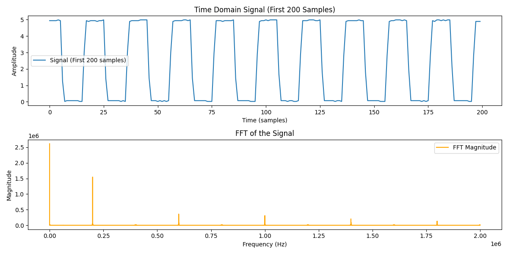

# ScopeBind

ScopeBind is a Python package that provides bindings for the **Instrustar ISDS205X** USB oscilloscope, allowing easy data acquisition and visualization.

## Installation

To set up the environment and install dependencies:

```bash
# Create and activate a virtual environment
python -m venv venv
source venv/bin/activate  # On Windows, use: venv\Scripts\activate

# Install dependencies
pip install -r requirements.txt
```

## Usage

Here is a minimal example demonstrating how to acquire and process data from the oscilloscope:

```python
from scopebind.device import Device

sampling_rate = 4000000  # Supported: [1000000, 4000000, 8000000, 16000000, 48000000]
voltage_range = (0, 5000)  # in mV

# Setup the oscilloscope device connection & start capturing data
scope = Device()
scope.start(sampling_rate, voltage_range)  

# Read data
raw_data = scope.read(1024*4)  # Reading 4 KB of data

# Stop the capture
scope.stop()
```

## Data Visualization

Once the data is acquired, we can plot the signal and its frequency spectrum:



## Supported Device

- **Instrustar ISDS205X**

## Credits

This package is based on the **Instrustar SDK**, available at:  
[Instrustar SDK Repository](https://github.com/instrustar-dev/SDK/tree/master)

---

For any issues or contributions, feel free to submit a pull request!

